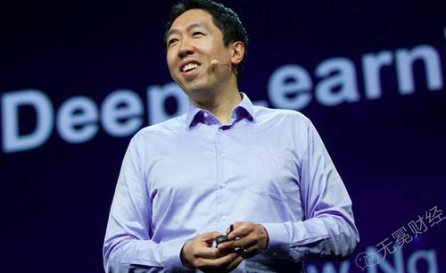

吴恩达
1.简介
吴恩达是华裔个人美国人，斯坦福大学计算机科学系和电子工程系副教授，人工智能研究室主任，DeepLearning.AI创始人，也是在线教育平台Coursera的联合创始人。他也是人工智能、机器学习领域国际上最权威的学者之一。

1992年，吴恩达就读新加坡莱佛士书院，1997年获得了卡内基梅隆大学的计算机科学学士学位。1998年获得了麻省理工学院的硕士学位，2002年获得了加州大学伯克利分校的博士学位，并开始在斯坦福大学工作。2012年，吴恩达领导的一个团体教会一个由16000台计算机组成的网络系统，在数以万计张照片中辨认出猫的照片。2014年5月，吴恩达加入百科，担任百度首席科学家，负责百度研究院的领导工作，尤其是Baidu Brain（百度大脑）计划。
2.研究经历
2010年，时任斯坦福大学教授的吴恩达加入谷歌开发团队XLab——这个团队已先后为谷歌开发无人驾驶汽车和谷歌眼镜两个知名项目。
  吴恩达与谷歌顶级工程师开始合作建立全球最大的“神经网络”，这个神经网络能以与人类大脑学习新事物相同的方式来学习现实生活。谷歌将这个项目命名为“谷歌大脑”。
  吴恩达最知名的是，所开发的人工神经网络通过观看一周YouTube视频，自主学会识别哪些是关于猫的视频。这个案例为人工智能领域翻开崭新一页。吴恩达表示，未来将会在谷歌无人驾驶汽车上使用该项技术，来识别车前面的动物或者小孩，从而及时躲避。
  2014年5月16日，百度宣布吴恩达加入百度，担任百度公司首席科学家，负责百度研究院的领导工作，尤其是Baidu Brain计划。
  2014年5月19日，百度宣布任命吴恩达博士为百度首席科学家，全面负责百度研究院。这是中国互联网公司迄今为止引进的最重量级人物。消息一经公布，就成为国际科技界的关注话题。美国权威杂志《麻省理工科技评论》(MITTechnology Review)甚至用充满激情的笔调对未来给予展望：“百度将领导一个创新的软件技术时代，更加了解世界。”
  2017年10月，吴恩达将出任Woebot公司新任董事长，该公司拥有一款同名聊天机器人。

2017年12月，吴恩达宣布成立人工智能公司Landing.ai，担任公司的首席执行官。
  在2019世界人工智能大会期间， Landing AI创始人、著名科学家吴恩达接受新浪科技专访，谈到了对5G、深度学习、个人数据隐私等方面的看法。在谈到深度学习时，吴恩达表示，深度学习还有很大的潜力，是一项被证明有效的技术，我们需要继续加大投入。
3.主要成就
①机器学习
吴恩达早期的工作包括斯坦福自动控制直升机项目，吴恩达团队开发了世界上最先进的自动控制直升机之一。
吴恩达同时也是机器学习、机器人技术和相关领域的100多篇论文的作者或合作者，他在计算机视觉的一些工作被一系列的出版物和评论文章所重点引用。
②人工智能
早期的另一项工作是the STAIR (Stanford Artificial Intelligence Robot) project，即斯坦福人工智能机器人项目，项目最终开发了广泛使用的开源机器人技术软件平台ROS。
2011年，吴恩达在谷歌成立了“Google Brain”项目，这个项目利用谷歌的分布式计算框架计算和学习大规模人工神经网络。这个项目重要研究成果是，在16000个CPU核心上利用深度学习算法学习到的10亿参数的神经网络，能够在没有任何先验知识的情况下，仅仅通过观看无标注的YouTube的视频学习到识别高级别的概念，如猫，这就是著名的“Google Cat”。这个项目的技术已经被应用到了安卓操作系统的语音识别系统上。
③在线教育

吴恩达是在线教育平台Coursera的联合创始人，吴恩达在2008年发起了“Stanford Engineering Everywhere”（SEE）项目，这个项目把斯坦福的许多课程放到网上，供免费学习。NG也教了一些课程，如机器学习课程，包含了他录制的视频讲座和斯坦福CS299课程的学生材料。
吴恩达的理想是让世界上每个人能够接受高质量的、免费的教育。今天，Coursera和世界上一些顶尖大学的合作者们一起提供高质量的免费在线课程。Coursera是世界上最大的MOOC平台。
4.所获荣耀

2007年，吴恩达获得斯隆奖（Sloan Fellowship）。
2008年，吴恩达入选“the MIT Technology Review TR35”，即《麻省理工科技创业》杂志评选出的科技创新35俊杰，入选者是35岁以下的35个世界上最顶级的创新者之一。
“计算机和思想奖”的获得者。
2013年，吴恩达入选《时代》杂志年度全球最有影响力100人，成为16位科技界代表之一。、
2021年，被评选为“2021福布斯中国·北美华人精英TOP 60”。
2023年，被评为首届全球AI行业的领导者。
5.人物评价
吴恩达加盟百度被认为是中国互联网公司迄今为止引入的最重要的外援。
